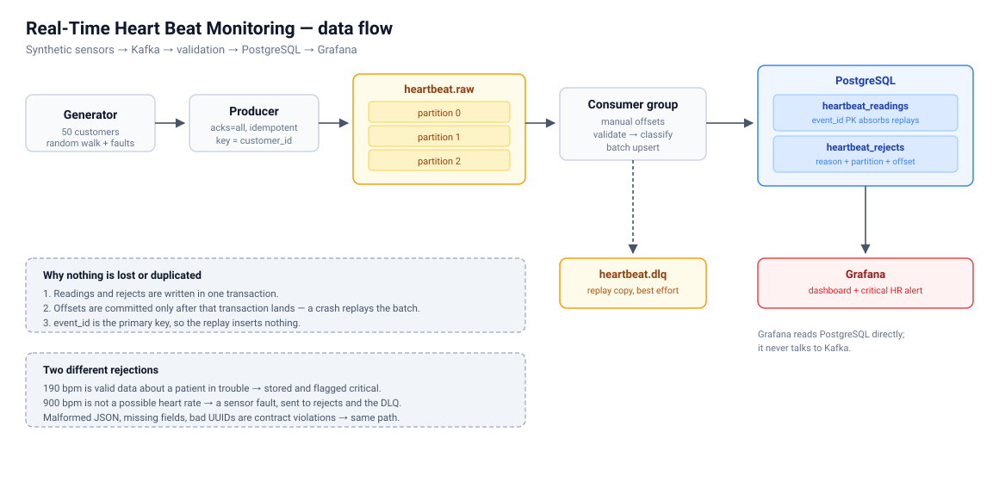
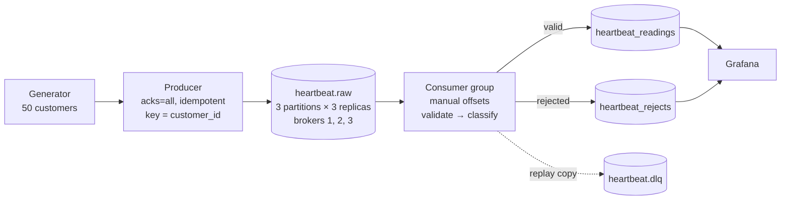

# Real-Time Customer Heart Beat Monitoring

[](https://github.com/josephforson285/kafka-heartbeat-monitor/actions/workflows/ci.yml)

A streaming pipeline that simulates heart rate sensors, moves the readings through
Apache Kafka, validates and classifies them, stores them in PostgreSQL, and shows
them on a Grafana dashboard with an alert for patients in a critical range.





## Quick start


Requires Docker and Python 3.11+.

```bash
cp .env.example .env          # then edit the passwords
python3 -m venv .venv
.venv/bin/pip install -e ".[dev]"

docker compose up -d          # Kafka, PostgreSQL, Grafana
.venv/bin/heartbeat create-topics
```

The schema is applied automatically when PostgreSQL first starts. Run
`heartbeat init-db` to apply it to a database that already exists — it is
idempotent either way.

Then, in two terminals:

```bash
.venv/bin/heartbeat produce      # stream synthetic readings into Kafka
.venv/bin/heartbeat consume      # write them into PostgreSQL
```

Open Grafana at <http://localhost:3000> and the dashboard is already there.

| Service | Port | Notes |
|---|---|---|
| Kafka | 9092, 9094, 9096 | three brokers, KRaft, no ZooKeeper |
| PostgreSQL | 5434 | 5432 and 5433 avoid clashing with other local databases |
| Grafana | 3000 | credentials from `.env` |

Upgrading an existing stack: the broker service was renamed `kafka` → `kafka1`, so
`docker compose down -v` leaves the old container behind holding port 9092. Use
`docker compose down -v --remove-orphans`. The old `heartbeat_kafka_data` volume is
left behind for the same reason — it is unused, and
`docker volume rm heartbeat_kafka_data` reclaims the space.

## Commands

```
heartbeat init-db                        apply the database schema
heartbeat create-topics                  create the topics, or verify they match config
heartbeat topic-info                     leader and in-sync replicas per partition
heartbeat produce [--count N] [--duration S] [--rate R]
heartbeat consume [--group ID] [--max-messages N] [--drain]
```

Every stage is re-runnable; running any of them twice is a no-op the second time.
`--drain` stops the consumer once it is caught up, which is what the tests and the
demo script use.

A `Makefile` wraps the longer incantations — `make up`, `make test-all`,
`make proofs`, `make lag`, `make reset`. Run `make help` for the list. Producing and
consuming stay on the CLI, where the flags are discoverable.

## Design decisions

### The brief says ZooKeeper; this uses KRaft

Apache Kafka 4 removed ZooKeeper. The broker is the official `apache/kafka` image
running in KRaft mode, which is the only mode that still exists. `confluent-kafka`
is the Python client library — the broker is Apache Kafka either way, in the same
sense that `psycopg` is a driver and PostgreSQL is the database.

### The message carries an `event_id` the brief does not mention

The brief lists `customer_id`, `timestamp` and `heart_rate`. With only those three
fields there is no way to tell a redelivered message from a new one, and Kafka
redelivers whenever a consumer dies between processing and committing.

So the producer stamps a UUID, `event_id` is the primary key of
`heartbeat_readings`, and inserts use `ON CONFLICT DO NOTHING`. At-least-once
delivery becomes effectively-once *storage*. This — not Kafka transactions — is
the answer to "how do you get exactly-once?"

### Messages are keyed by `customer_id`

Kafka only guarantees ordering within a partition. Keying by customer sends one
patient's readings to one partition, so their readings stay in order. Unkeyed,
a patient's 11:00:03 reading could be processed before their 11:00:01 one, which
for time-series vitals is a defect.

The topic has three partitions so that a consumer group can hold more than one
member and actually rebalance. Partition count is effectively one-way: raising it
later changes which partition a key maps to and breaks that ordering guarantee for
existing keys.

### Invalid and alerting are different things

The brief says the consumer should check for "heart rate too high/low" and implies
filtering those out. That is backwards for a monitoring system:

- **190 bpm** is a real reading from a patient who needs attention. Stored, and
  classified `critical`. Dropping it would discard the event the system exists to catch.
- **900 bpm** is not a possible human heart rate. That is a broken sensor, and it
  goes to `heartbeat_rejects` with the reason attached.

Contract violations — malformed JSON, missing fields, a non-UUID `event_id`, a
timestamp with no offset — take the same path as sensor faults. Nothing is silently
discarded; every rejection is queryable with the partition and offset it came from.

### What a change to the message contract costs

Each kind of change was pushed through the running pipeline to see what it actually
does, rather than reasoned about:

| Change | Result |
|---|---|
| Add a field, bump `schema_version` | **stored** — unknown keys are ignored, so old consumers keep working |
| Remove a required field | rejected: `missing field(s): heart_rate` |
| Change a type | rejected: `heart_rate must be an integer, got '72'` |
| Rename a field | rejected: `missing field(s): heart_rate` |
| Change what a field *means* | **stored, silently wrong** |

Structural breakage is loud. Every one lands in `heartbeat_rejects` naming itself,
carrying the partition and offset it came from, and the pipeline keeps running.

The last row is the dangerous one, and it is not hypothetical — units and timezones
are among the most common real data faults. A firmware update reporting a different
unit, or `event_time` arriving in local time, produces structurally perfect JSON.
It parses, classifies and stores. Nothing rejects it and nothing alerts. Every
affected reading is wrong and this system will not tell you.

### `schema_version` is carried, and deliberately not enforced

The contract includes `schema_version`. The consumer reads it and does not gate on
it, because rejecting an unknown version would turn a backward-compatible change
into a total outage — the opposite of what a version field should buy.

It is also **not stored**. A v2 message with extra fields lands in
`heartbeat_readings` indistinguishable from a v1 one: same columns, nothing to
separate them. That is a deliberate trade resting on four assumptions, all true here:

1. **One producer implementation.** Nothing else writes to this topic.
2. **Semantic changes arrive with structural ones**, so validation catches them —
   the assumption the table above shows to be the weakest.
3. **Both ends ship together.** Producer and consumer are one repository and one
   deploy, so there is no window where a v2 producer runs against a v1 consumer.
4. **Quarantine can be time-based.** Every row records `ingested_at`,
   `kafka_partition` and `kafka_offset`, so a bad producer's output can be found by
   time window or offset range. Coarser than filtering on a version, but sufficient.

If any of those stops holding — a second team producing, or independent deploys —
the fix is one column: add `schema_version` to `heartbeat_readings` and to the
insert. It is deliberately not there yet, because a column nobody queries is not
free to a reader trying to understand the schema.

### Three brokers, so replication is real

Replication factor is how many *different* brokers hold a copy of a partition, so
RF=3 is impossible on one broker — Kafka refuses the topic outright. On a single
broker `acks=all` is also nearly meaningless: "all in-sync replicas" is one machine,
the same one `acks=1` would have used.

With three brokers, `replication_factor: 3` and `min_insync_replicas: 2`, a write is
only acknowledged once two brokers hold it, and one broker can die without stopping
ingestion. Two brokers would not help: RF=2 with `min.insync.replicas=2` stops writes
when either dies, and with 1 there is no guarantee left. Three is the smallest cluster
where failure is survivable — the same reason KRaft's controller quorum needs three
voters to tolerate losing one.

The internal offsets and transaction-state topics are replicated too. Leaving those
at 1 while the data topic is replicated survives a broker loss but forgets where the
consumer had got to.

### Topics are never created by accident

`auto.create.topics.enable` is off. Left on — as it is by default — producing to a
mistyped topic silently creates it at the broker defaults: one partition, no
replication. Real data then lands in a topic nobody configured.

`heartbeat create-topics` also compares topics that already exist against the config
and refuses to continue on a mismatch, rather than reporting "already exists" and
moving on. This was not hypothetical: an auto-created `heartbeat.dlq` sat at RF=1
while the config claimed 3, and the old existence-only check said nothing.

### Offsets are committed after the write, never before

Readings and rejects for one poll go into PostgreSQL in a single transaction. Only
once that transaction lands does the consumer commit its offsets. A crash in between
replays the batch rather than losing it, and the primary key absorbs the replay.

Auto-commit is off. With it on, offsets advance on a timer whether or not the rows
were ever written.

### The dead-letter topic is a convenience, not the record of truth

`heartbeat_rejects` is written inside the transaction. The copy forwarded to
`heartbeat.dlq` happens afterwards and is best-effort, so that a failed produce can
never mean data loss. The topic exists so a fixed consumer can replay poison messages
without re-reading the whole log.

### The dashboard answers two questions, and says which is which

It is laid out as four bands, because a monitoring screen is read top to bottom
under time pressure:

1. **Fleet** — patients monitored, patients needing attention, ingest latency,
   rejections. `Patients needing attention` counts *people whose latest reading is
   abnormal*, not readings, so one noisy sensor cannot inflate it.
2. **Selected patient** — their actual readings in order, plus highest, lowest,
   average, count and abnormal count for the window. This sits directly under the
   fleet summary because it is what someone opens the dashboard to look at.
3. **Who needs attention** — patients ranked by how many critical and tachycardia
   episodes they logged across the window, with their peak and lowest reading.
4. **Pipeline health** — classification mix and every rejection with its offset.

The patient selector is single-select on purpose. Earlier it defaulted to *All* and
filtered exactly one of eight panels, so selecting a patient changed almost nothing
on screen while appearing to. Now every panel is either scoped to the selected
patient and titled with their id, or explicitly labelled as fleet-wide.

### An alert calibrated against nothing fires against everything

The alert first asked whether any patient had a critical reading in the last five
minutes, with a threshold of *greater than zero*. The answer was 45 of 50 patients,
so it fired permanently. That is the same mistake as counting patients on the fleet
tile — anomalies here are spread evenly, so any presence test is always true — and a
permanently firing alert is not an alert, it is background noise nobody reads.

It is now calibrated against the measured baseline. Twenty minutes of normal traffic
runs at 36.6 critical readings a minute, standard deviation 14.9, peak 54. The
threshold is 120 a minute sustained for two minutes — roughly five standard
deviations out — so ordinary variation is silent.

Both halves were verified rather than assumed. Under normal load it stayed inactive
for six minutes with the rate moving between 39 and 57. Sustaining an injected surge
walked it `inactive → pending → firing` at about 490 a minute.

It is a fleet-level surge detector, not a clinical alarm. Alerting on an individual
patient needs a baseline for that patient, for the same reason the dashboard stopped
ranking bradycardia: a fixed threshold cannot tell someone who is deteriorating from
someone who simply runs low.

### Absence of data is the failure nothing else catches

`Patients monitored` counts who is reporting. When the producer was killed it kept
reading **50** — those patients are still inside the time window — while the newest
reading aged silently and every panel carried on showing the last good data. A dead
sensor looked exactly like a healthy patient.

`Patients gone silent` counts patients that reported earlier in the window but have
sent nothing for sixty seconds. Killing the producer walks it from 0 to 50 once that
threshold passes, which is the only signal on the dashboard that data has stopped
arriving at all.

For a monitor this is the failure that matters most, because it is the one that
looks like good news.

### Ranking on one reading is not a patient's condition

The attention list first showed each patient's *latest* reading. Sampled three
times over eight seconds it returned 15, then 12, then 8 patients, and the set of
critical ones changed completely each time. Patients appeared to enter and leave
crisis every refresh, because a single reading is a coin flip, not a condition.

It now counts episodes across the whole window. The same patients hold the top,
their counts drifting by one as the window slides — which is a sliding window
behaving correctly rather than noise.

Two measurement decisions came out of looking at the data rather than assuming:

**Bradycardia is not ranked.** It tracks resting baseline. A patient who normally
sits at 60 bpm logged 253 crossings in five minutes while one at 78 logged two —
that is a characteristic, not deterioration. A fixed threshold cannot tell them
apart; a real system would alert on change from each patient's own baseline, which
needs per-patient baselines this project does not build.

**The fleet tile counts readings, not patients.** All 50 patients logged a critical
or tachycardia reading in five minutes, so a patient count reads 50 of 50 and says
nothing. That is an artefact of the generator spreading anomalies evenly; real
distress concentrates in a few people, and there the patient count would be the
right measure. The tile says which it is counting.

### The patient chart plots readings, not an aggregate

One patient produces about one reading a second, so fifteen minutes is under a
thousand points — few enough to draw every one. The panel does exactly that, and
nothing is aggregated away.

It began as an average per interval, which was wrong in a way worth keeping in the
record. Readings arrive faster than a chart has pixels, so each point covered an
interval holding dozens of them. Averaged, one minute of this data plots **73 bpm**
while the readings inside span **20 to 250** — a patient at 250 drawn as normal, on
the same screen as a table listing them critical.

Switching to the maximum would have fixed that and broken the opposite case: a
bucket of 31, 72, 75, 80 plots 80, and the patient at 31 disappears. This system
alerts on both ends, so neither aggregate is safe — which is why the patient panel
plots the readings themselves.

The summary beside it shows highest, lowest and average together for the same
reason: for the patient above, the average is 79 and the highest is 250. Either
number alone misleads.

The general point: an aggregate chosen for a dashboard is a claim about which
information you are willing to lose. For vitals, the average is the one value you
can afford least.

### Grafana is provisioned from files

The datasource, dashboard and alert rule are YAML and JSON in `docker/grafana/`,
mounted into the container. Configuring Grafana through its UI would put that state
in a Docker volume, and a fresh clone would come up with an empty Grafana.

### Deliberately not included

Schema Registry and Avro (a shared schema module and strict parsing are proportionate
here), Prometheus and a Kafka metrics exporter (consumer lag is one CLI command), and
Spark (the same topic could feed a windowed aggregation, but the per-record path does
not need it). Reaching for those at this scale would be over-engineering.

## Failure modes

`scripts/demo_failure_modes.sh` proves three of them and asserts the results rather
than describing them. It resets the stack, so run it deliberately.

**A consumer killed mid-stream loses nothing and duplicates nothing.** The consumer
is `SIGKILL`ed while the producer is still running, then restarted:

```
killed with SIGKILL after 677 of 2000 rows were written
recovery: consumed=1313 inserted=1288 duplicates=0 rejected=25
PASS  no records lost (2000)
PASS  no records duplicated (1965)
```

**A second consumer joining the group triggers a rebalance.**

```
A: assigned [0,1,2] → revoked [0,1,2] → assigned [0,1]
B: assigned [2]
```

**Malformed messages are recorded and skipped.** Five deliberately broken payloads:

```
not valid JSON: Expecting value: line 1 column 1 (char 0)
heart_rate must be an integer, got 'seventy'
event_id is not a UUID: 'not-a-uuid'
missing field(s): event_id, event_time, heart_rate
not valid JSON  (invalid UTF-8)
```

**A broker can die mid-stream without stopping ingestion.** `kafka2` is stopped while
the producer and consumer are running:

```
before      partition 2   leader 2   replicas [1,2,3]   isr [1,2,3]
one down    partition 2   leader 3   replicas [1,2,3]   isr [1,3]   UNDER-REPLICATED, missing [2]
recovered   partition 2   leader 3   replicas [1,2,3]   isr [1,2,3]

PASS  ingestion continued through the broker failure (7822 -> 10254 rows)
PASS  in-sync replicas degraded while it was down (4)
PASS  in-sync replicas recovered (0)
PASS  still no duplicates (19623)
```

Leadership moved off the dead broker on its own and the pipeline kept writing —
`min.insync.replicas: 2` was still satisfied by the two survivors. Note that
leadership stays on broker 3 after recovery; Kafka does not move it back
automatically.

### What survives a sudden shutdown

The committed offset is the boundary. Everything up to it is durable in PostgreSQL;
everything after it is replayed and absorbed by the primary key. Each component was
killed on purpose to check:

| What dies | What is lost | What happens on resume |
|---|---|---|
| Consumer, `SIGTERM` | nothing — the batch in hand finishes and commits | resumes at the committed offset, replays nothing |
| Consumer, `SIGKILL` | nothing durable — the uncommitted batch is still on the topic | replays that batch, `ON CONFLICT` absorbs it |
| PostgreSQL | nothing durable — same uncommitted batch | leaves the group cleanly, exits 3; replays on restart |
| Every broker, consumer running | nothing — with no messages there is nothing to commit | self-heals: session times out, rejoins, carries on |
| Every broker, producer running | every buffered reading | reported as `unflushed`, exit 1. Those readings are gone |
| Producer, `SIGTERM` | nothing — `close()` flushes what is buffered | starts fresh; there is nothing to replay |
| Producer, `SIGKILL` | whatever sat in the local buffer, **with no record of it** | starts fresh; the gap is permanent |

The consumer side is safe because the order is fixed: write the rows, commit the
offsets. Interrupt it anywhere and the worst case is that a batch is processed twice,
which the primary key makes free.

**The producer is the exception, and it is worth being straight about.** `produce()`
buffers locally and delivery is confirmed later on a callback, so a `SIGKILL` takes
the buffer with it — measured at roughly 51 readings out of 1,200 at 300/s, and the
process dies before it can report a single one. There is no replay, because a heart
rate sensor has no log to replay from. `acks=all` and `enable.idempotence` protect a
message once Kafka has been asked to store it; they cannot protect one that never
left the producer.

A real deployment closes that gap on the device: the sensor buffers to its own
storage and retries. Nothing on the Kafka side can do it for you.

The figures above are from the run whose logs are committed in
[docs/sample_output/](docs/sample_output/); re-running the script regenerates both
together. Alongside them is
[database-contents.txt](docs/sample_output/database-contents.txt) — the table
definition, the classification breakdown, recent rows with the partition and offset
they came from, and the count that matters:

```
 total_readings | distinct_event_ids
----------------+--------------------
           5890 |               5890
```

**The database going away is survivable too.** Stopping PostgreSQL mid-consume leaves
the group cleanly and exits 3 with one readable line; restarting it and re-running
`consume --drain` picks up the uncommitted batch with `duplicates=0`.

Consumer lag, at any time. Note the internal listener: run inside a broker container,
the external addresses advertise `localhost:909x`, which from in there resolves only
to that same container, so any call needing a second broker times out.

```bash
docker compose exec kafka1 /opt/kafka/bin/kafka-consumer-groups.sh \
  --bootstrap-server kafka1:19092 --describe --group heartbeat-writer
```

## Performance

At 200 readings/second with producer and consumer running together, measured as
`ingested_at - event_time` over rows written during that window:

| p50 | p95 | max | rows |
|---|---|---|---|
| 134 ms | 248 ms | 1206 ms | 3925 |

The consumer sustains 9,753 messages/second — about 50× this workload. The limit is
the synchronous offset commit, one round trip per batch, which is also the thing that
makes a crash replay rather than lose. `batch_size` is the dial between the two.
See [docs/performance_metrics.md](docs/performance_metrics.md).

## Tests

```bash
.venv/bin/python -m pytest
```

61 unit tests covering the event contract's rejection paths, the classification band
boundaries either side of every threshold, and configuration loading and validation. They are
pure functions — no broker or database — and run in under a second.

Eleven more test the guarantees that live in the DDL rather than in Python: that
`ON CONFLICT` really does suppress a replayed batch, that a batch failing a `CHECK`
constraint rolls back completely, and that a reject payload which is not valid UTF-8
can still be stored. Those truncate their tables, so they are skipped unless you opt
in against a disposable database:

```bash
HEARTBEAT_TEST_DSN="host=localhost port=5434 dbname=heartbeat_test user=heartbeat password=..." \
HEARTBEAT_ALLOW_DESTRUCTIVE_TESTS=1 .venv/bin/python -m pytest
```

The demo script's reset (`docker compose down -v`) drops this database along with
everything else, so recreate it when you have just run the proofs:

```bash
docker compose exec postgres psql -U heartbeat -d postgres -c "CREATE DATABASE heartbeat_test;"
```

CI runs all 72 against a real PostgreSQL service, then brings up this repository's
own `docker-compose.yml` and runs `scripts/demo_failure_modes.sh` against it. So the
failure-mode claims below are re-proven on every push rather than asserted once —
and the logs are attached to each run as a build artifact.

## Layout

```
config/config.yaml            parameters (secrets live in .env)
sql/001_schema.sql            tables, constraints, indexes
src/heartbeat/
  schema.py                   the event contract, shape and parsing only
  validation.py               plausibility and clinical classification
  generator.py                synthetic readings
  producer.py                 Kafka producer and its run loop
  consumer.py                 poll, validate, write, then commit
  db.py                       transactional batch upsert
  config.py                   typed config loading and validation
  logging_conf.py             logging setup
  runtime.py                  cooperative shutdown
  cli.py                      the single entrypoint
docker/grafana/               provisioned datasource, dashboard, alert
scripts/demo_failure_modes.sh the proofs
docs/                         diagram, metrics, test plan, sample output
tests/                        unit tests
```

## What would change in production

Replication is already what production would run — three brokers, `replication.factor=3`,
`min.insync.replicas=2`, `acks=all`. What is still missing is everything around it:

- **The brokers share a machine.** Three containers on one host survive a broker
  process dying, which is what proof 4 shows, but not the host dying. Real clusters
  spread brokers across failure domains.
- **No TLS or SASL.** Every listener is plaintext and unauthenticated.
- **No Schema Registry.** A shared Python module is enough while one team owns both
  ends of the topic. It stops being enough the moment someone else produces.
- **`heartbeat_readings` is a single table.** At sustained volume it wants
  time-based partitioning and a retention policy.
- **Broker metrics are read off the CLI.** Production exports JMX to Prometheus and
  alerts on under-replicated partitions rather than looking at `topic-info` by hand.
