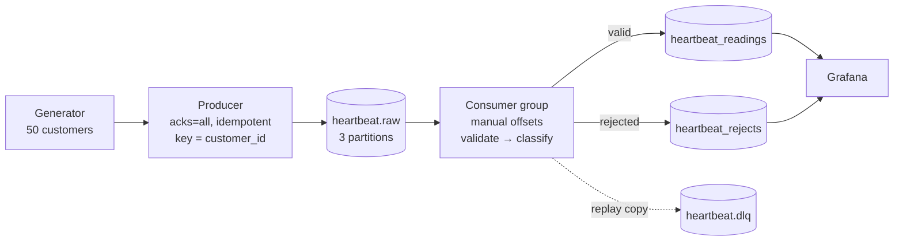

# Real-Time Customer Heart Beat Monitoring

[](https://github.com/josephforson285/kafka-heartbeat-monitor/actions/workflows/ci.yml)

A streaming pipeline that simulates heart rate sensors, moves the readings through
Apache Kafka, validates and classifies them, stores them in PostgreSQL, and shows
them on a Grafana dashboard with an alert for patients in a critical range.




## Quick start

Requires Docker and Python 3.11+.

```bash
cp .env.example .env          # then edit the passwords
python3 -m venv .venv
.venv/bin/pip install -e ".[dev]"

docker compose up -d          # Kafka, PostgreSQL, Grafana
.venv/bin/heartbeat create-topics
```

The schema is applied automatically when PostgreSQL first starts. Run
`heartbeat init-db` to apply it to a database that already exists — it is
idempotent either way.

Then, in two terminals:

```bash
.venv/bin/heartbeat produce      # stream synthetic readings into Kafka
.venv/bin/heartbeat consume      # write them into PostgreSQL
```

Open Grafana at <http://localhost:3000> and the dashboard is already there.

| Service | Port | Notes |
|---|---|---|
| Kafka | 9092 | KRaft, single broker |
| PostgreSQL | 5434 | 5432 and 5433 avoid clashing with other local databases |
| Grafana | 3000 | credentials from `.env` |

## Commands

```
heartbeat init-db                        apply the database schema
heartbeat create-topics                  create heartbeat.raw and heartbeat.dlq
heartbeat produce [--count N] [--duration S] [--rate R]
heartbeat consume [--group ID] [--max-messages N] [--drain]
```

Every stage is re-runnable; running any of them twice is a no-op the second time.
`--drain` stops the consumer once it is caught up, which is what the tests and the
demo script use.

## Design decisions

### The brief says ZooKeeper; this uses KRaft

Apache Kafka 4 removed ZooKeeper. The broker is the official `apache/kafka` image
running in KRaft mode, which is the only mode that still exists. `confluent-kafka`
is the Python client library — the broker is Apache Kafka either way, in the same
sense that `psycopg` is a driver and PostgreSQL is the database.

### The message carries an `event_id` the brief does not mention

The brief lists `customer_id`, `timestamp` and `heart_rate`. With only those three
fields there is no way to tell a redelivered message from a new one, and Kafka
redelivers whenever a consumer dies between processing and committing.

So the producer stamps a UUID, `event_id` is the primary key of
`heartbeat_readings`, and inserts use `ON CONFLICT DO NOTHING`. At-least-once
delivery becomes effectively-once *storage*. This — not Kafka transactions — is
the answer to "how do you get exactly-once?"

### Messages are keyed by `customer_id`

Kafka only guarantees ordering within a partition. Keying by customer sends one
patient's readings to one partition, so their readings stay in order. Unkeyed,
a patient's 11:00:03 reading could be processed before their 11:00:01 one, which
for time-series vitals is a defect.

The topic has three partitions so that a consumer group can hold more than one
member and actually rebalance. Partition count is effectively one-way: raising it
later changes which partition a key maps to and breaks that ordering guarantee for
existing keys.

### Invalid and alerting are different things

The brief says the consumer should check for "heart rate too high/low" and implies
filtering those out. That is backwards for a monitoring system:

- **190 bpm** is a real reading from a patient who needs attention. Stored, and
  classified `critical`. Dropping it would discard the event the system exists to catch.
- **900 bpm** is not a possible human heart rate. That is a broken sensor, and it
  goes to `heartbeat_rejects` with the reason attached.

Contract violations — malformed JSON, missing fields, a non-UUID `event_id`, a
timestamp with no offset — take the same path as sensor faults. Nothing is silently
discarded; every rejection is queryable with the partition and offset it came from.

### Offsets are committed after the write, never before

Readings and rejects for one poll go into PostgreSQL in a single transaction. Only
once that transaction lands does the consumer commit its offsets. A crash in between
replays the batch rather than losing it, and the primary key absorbs the replay.

Auto-commit is off. With it on, offsets advance on a timer whether or not the rows
were ever written.

### The dead-letter topic is a convenience, not the record of truth

`heartbeat_rejects` is written inside the transaction. The copy forwarded to
`heartbeat.dlq` happens afterwards and is best-effort, so that a failed produce can
never mean data loss. The topic exists so a fixed consumer can replay poison messages
without re-reading the whole log.

### Grafana is provisioned from files

The datasource, dashboard and alert rule are YAML and JSON in `docker/grafana/`,
mounted into the container. Configuring Grafana through its UI would put that state
in a Docker volume, and a fresh clone would come up with an empty Grafana.

### Deliberately not included

Schema Registry and Avro (a shared schema module and strict parsing are proportionate
here), Prometheus and a Kafka metrics exporter (consumer lag is one CLI command), and
Spark (the same topic could feed a windowed aggregation, but the per-record path does
not need it). Reaching for those at this scale would be over-engineering.

## Failure modes

`scripts/demo_failure_modes.sh` proves three of them and asserts the results rather
than describing them. It resets the stack, so run it deliberately.

**A consumer killed mid-stream loses nothing and duplicates nothing.** The consumer
is `SIGKILL`ed while the producer is still running, then restarted:

```
killed with SIGKILL after 677 of 2000 rows were written
recovery: consumed=1313 inserted=1288 duplicates=0 rejected=25
PASS  no records lost (2000)
PASS  no records duplicated (1965)
```

**A second consumer joining the group triggers a rebalance.**

```
A: assigned [0,1,2] → revoked [0,1,2] → assigned [0,1]
B: assigned [2]
```

**Malformed messages are recorded and skipped.** Five deliberately broken payloads:

```
not valid JSON: Expecting value: line 1 column 1 (char 0)
heart_rate must be an integer, got 'seventy'
event_id is not a UUID: 'not-a-uuid'
missing field(s): event_id, event_time, heart_rate
not valid JSON  (invalid UTF-8)
```

Logs from these runs are in [docs/sample_output/](docs/sample_output/).

Consumer lag, at any time:

```bash
docker compose exec kafka /opt/kafka/bin/kafka-consumer-groups.sh \
  --bootstrap-server localhost:9092 --describe --group heartbeat-writer
```

## Performance

At 200 readings/second with producer and consumer running together, measured as
`ingested_at - event_time` over rows written during that window:

| p50 | p95 | max | rows |
|---|---|---|---|
| 128 ms | 230 ms | 696 ms | 3925 |

See [docs/performance_metrics.md](docs/performance_metrics.md).

## Tests

```bash
.venv/bin/python -m pytest
```

43 unit tests covering the event contract's rejection paths, the classification band
boundaries either side of every threshold, and configuration validation. They are
pure functions — no broker or database — and run in under a second.

Eleven more test the guarantees that live in the DDL rather than in Python: that
`ON CONFLICT` really does suppress a replayed batch, that a batch failing a `CHECK`
constraint rolls back completely, and that a reject payload which is not valid UTF-8
can still be stored. Those truncate their tables, so they are skipped unless you opt
in against a disposable database:

```bash
HEARTBEAT_TEST_DSN="host=localhost port=5434 dbname=heartbeat_test user=heartbeat password=..." \
HEARTBEAT_ALLOW_DESTRUCTIVE_TESTS=1 .venv/bin/python -m pytest
```

CI runs all 54 against a real PostgreSQL service on every push. End-to-end behaviour
is covered by the demo script instead.

## Layout

```
config/config.yaml            parameters (secrets live in .env)
sql/001_schema.sql            tables, constraints, indexes
src/heartbeat/
  schema.py                   the event contract, shape and parsing only
  validation.py               plausibility and clinical classification
  generator.py                synthetic readings
  producer.py                 Kafka producer and its run loop
  consumer.py                 poll, validate, write, then commit
  db.py                       transactional batch upsert
  config.py                   typed config loading and validation
  runtime.py                  cooperative shutdown
  cli.py                      the single entrypoint
docker/grafana/               provisioned datasource, dashboard, alert
scripts/demo_failure_modes.sh the proofs
docs/                         diagram, metrics, test plan, sample output
tests/                        unit tests
```

## What would change in production

Replication factor is 1 because there is one broker, which means losing it loses
data. Production would run at least three brokers with `replication.factor=3` and
`min.insync.replicas=2`, keeping `acks=all` so a write is only acknowledged once a
majority holds it.

Beyond that: TLS and SASL on the broker, a Schema Registry once more than one team
produces to the topic, time-based partitioning on `heartbeat_readings` as it grows,
and broker metrics exported to Prometheus rather than read off the CLI.
