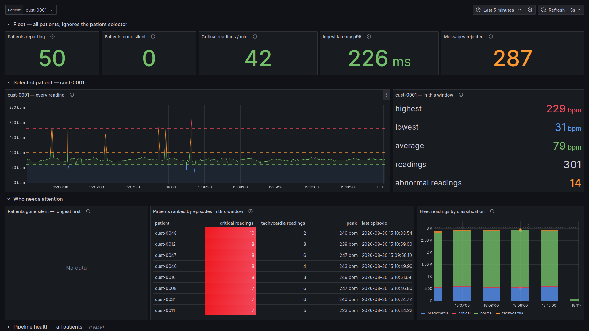
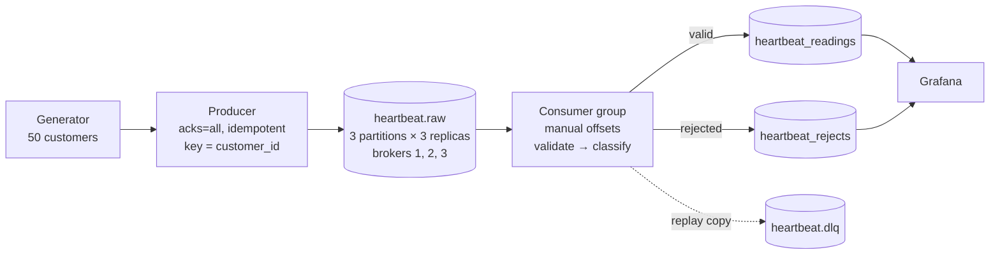
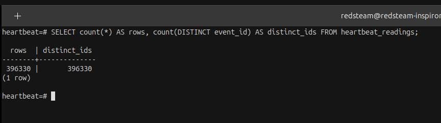

# Real-Time Customer Heart Beat Monitoring

[](https://github.com/josephforson285/kafka-heartbeat-monitor/actions/workflows/ci.yml)

Simulated heart rate sensors → **Apache Kafka** → validation → **PostgreSQL** →
**Grafana**, in real time.



* **50 patients**, ~50 readings/sec
* **3 Kafka brokers**, replication factor 3
* **Exactly-once storage** through `event_id` deduplication
* Rejected data is stored with its reason, partition and offset

---

## Architecture





## Quick start

Requires Docker and Python 3.11+.

```bash
cp .env.example .env          # then edit the passwords
python3 -m venv .venv
.venv/bin/pip install -e ".[dev]"

make up                       # Kafka ×3, PostgreSQL, Grafana — waits for healthy
.venv/bin/heartbeat create-topics
```

Then in two terminals:

```bash
.venv/bin/heartbeat produce      # stream synthetic readings into Kafka
.venv/bin/heartbeat consume      # write them into PostgreSQL
```

Grafana: http://localhost:3000

| Service | Port |
|---|---|
| Kafka | 9092, 9094, 9096 |
| PostgreSQL | 5434 |
| Grafana | 3000 |

## Commands

```
heartbeat init-db          apply the database schema
heartbeat create-topics    create the topics, or verify they match config
heartbeat topic-info       leader and in-sync replicas per partition
heartbeat produce [--count N] [--duration S] [--rate R]
heartbeat consume [--group ID] [--max-messages N] [--drain]
```


Run `make help` for shortcuts.

## What it proves

### Exactly-once storage

Replayed messages do not create duplicate database rows.



### Failure handling

`make proofs` verifies:

| Proof                          | Result                                   |
| ------------------------------ | ---------------------------------------- |
| Consumer killed mid-stream     | no lost or duplicate stored readings     |
| Second consumer joins          | partitions rebalance automatically       |
| Malformed payloads injected    | rejected without stopping the pipeline   |
| Broker killed during ingestion | leadership moves and ingestion continues |

Also tested: PostgreSQL outages, all brokers going down, producer shutdowns and contract changes.

See [docs/failure_modes.md](docs/failure_modes.md).

**Tests** see.
[docs/test_cases.md](docs/test_cases.md).

```bash
.venv/bin/python -m pytest    # 61 unit tests
make test-all                 # + 11 integration
make proofs                   # the four failure-mode proofs (resets the stack)
```

## Design decisions
 

More in [docs/design_decisions.md](docs/design_decisions.md).


**`event_id` enables exactly-once storage.**
It identifies retries, while `ON CONFLICT DO NOTHING` prevents duplicate inserts.

**Offsets move after database writes.**
A crash may replay messages, but committed data is not lost and duplicates are ignored.

**Alerts and invalid data are different.**
A plausible 190 bpm reading is stored and flagged; an impossible 900 bpm reading is rejected.

**Three brokers provide real replication.**
RF=3 with `min.insync.replicas=2` allows one broker to fail without stopping ingestion.

**Classifications are ranges.**
Labels such as `bradycardia` and `critical` are fixed thresholds, not medical diagnoses.


## Documentation

| Document                                              | Covers                 |
| ----------------------------------------------------- | ---------------------- |
| [design_decisions.md](docs/design_decisions.md)       | architecture choices   |
| [failure_modes.md](docs/failure_modes.md)             | failure behaviour      |
| [test_cases.md](docs/test_cases.md)                   | test results           |
| [performance_metrics.md](docs/performance_metrics.md) | latency and throughput |
| [architecture.svg](docs/architecture.svg)             | system architecture    |
| [screenshots/](docs/screenshots/)                     | running system         |
| [sample_output/](docs/sample_output/)                 | proof-run logs         |

