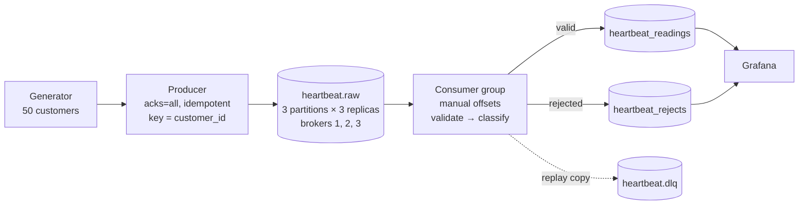

# Real-Time Customer Heart Beat Monitoring

[](https://github.com/josephforson285/kafka-heartbeat-monitor/actions/workflows/ci.yml)

Simulated heart rate sensors → **Apache Kafka** → validation → **PostgreSQL** →
**Grafana**, with the delivery guarantees proven rather than claimed.


- **50 patients**, ~50 readings a second, three Kafka brokers with replication factor 3
- **Exactly-once storage** — a replayed message is absorbed by the primary key, verified across crashes, broker failures and database outages
- **Bad data is kept, not dropped** — every rejection recorded with its reason, partition and offset
- **Failure modes proven on every push** — CI stands the whole stack up and kills things

---

## Architecture




## Quick start

Requires Docker and Python 3.11+.

```bash
cp .env.example .env          # then edit the passwords
python3 -m venv .venv
.venv/bin/pip install -e ".[dev]"

make up                       # Kafka ×3, PostgreSQL, Grafana — waits for healthy
.venv/bin/heartbeat create-topics
```

Then in two terminals:

```bash
.venv/bin/heartbeat produce      # stream synthetic readings into Kafka
.venv/bin/heartbeat consume      # write them into PostgreSQL
```

Grafana is at <http://localhost:3000> — the dashboard is already there, nothing to
import. The database schema applies itself when PostgreSQL first starts.

| Service | Port |
|---|---|
| Kafka | 9092, 9094, 9096 |
| PostgreSQL | 5434 |
| Grafana | 3000 |

## Commands

```
heartbeat init-db          apply the database schema
heartbeat create-topics    create the topics, or verify they match config
heartbeat topic-info       leader and in-sync replicas per partition
heartbeat produce [--count N] [--duration S] [--rate R]
heartbeat consume [--group ID] [--max-messages N] [--drain]
```

Every stage is re-runnable; running any twice is a no-op the second time.
`make help` lists shortcuts for the longer incantations — `make up`, `test-all`,
`proofs`, `lag`, `psql`, `reset`.

## What it proves

**Exactly-once storage.** These two numbers are equal after every crash, broker kill,
database outage and deliberate replay this system has been through:


**Four failure modes, re-run by CI on every push** — `make proofs`:

| Proof | What is killed | Result |
|---|---|---|
| 1 | The consumer, `SIGKILL`, mid-stream | nothing lost, nothing duplicated |
| 2 | Nothing — a second consumer joins | partitions redistribute automatically |
| 3 | Nothing — 5 malformed payloads injected | each rejected by name, pipeline survives |
| 4 | A broker, with data flowing | leadership moves, ingestion never stops |

Also verified: PostgreSQL dying mid-consume, all three brokers going down, both
producer shutdown paths, and five kinds of contract change. Full matrix in
[docs/failure_modes.md](docs/failure_modes.md).

**Performance** — p50 **134 ms**, p95 **248 ms** end to end; the consumer sustains
**9,753 msg/s**, about 50× this workload. [docs/performance_metrics.md](docs/performance_metrics.md).

**Tests** — 72 automated tests, plus 38 end-to-end cases run by the demo script.
[docs/test_cases.md](docs/test_cases.md).

```bash
.venv/bin/python -m pytest    # 61 unit tests
make test-all                 # + 11 integration
make proofs                   # the four failure-mode proofs (resets the stack)
```

## Design decisions, briefly

Full reasoning for all twenty in [docs/design_decisions.md](docs/design_decisions.md).
The five that matter most:

**The message carries an `event_id` the brief does not mention.** Without it there is
no way to tell a redelivery from a new reading. It is the primary key, inserts use
`ON CONFLICT DO NOTHING`, and at-least-once delivery becomes exactly-once *storage*.
That — not Kafka transactions — is the answer to "how do you get exactly-once?"

**Offsets are committed after the write, never before.** Readings and rejects go in
one transaction; only then do offsets move. A crash in between replays the batch
rather than losing it, and the primary key absorbs the replay.

**Invalid and alerting are different things.** 190 bpm is real data about a patient in
trouble — stored and flagged. 900 bpm is a broken sensor — rejected with its reason.
Dropping the first would discard the event the system exists to catch.

**Three brokers, so replication is real.** RF=3 is impossible on one broker, and
`acks=all` on a single broker means nothing. With `min.insync.replicas=2` a write
needs two copies and one broker can die without stopping ingestion.

**The classifications are ranges, not diagnoses.** `bradycardia` and `critical` name
fixed bands applied to one reading. Nothing accounts for age, activity, medication or
a patient's own baseline — a limit of a contract carrying only id, time and rate.

## Documentation

| Document | Covers |
|---|---|
| [design_decisions.md](docs/design_decisions.md) | why each choice was made, and what it cost |
| [failure_modes.md](docs/failure_modes.md) | what breaks it, what survives, what is lost |
| [test_cases.md](docs/test_cases.md) | all 70 cases with results |
| [performance_metrics.md](docs/performance_metrics.md) | latency, throughput, indexes |
| [architecture.svg](docs/architecture.svg) | data flow diagram |
| [screenshots/](docs/screenshots/) | the running system |
| [sample_output/](docs/sample_output/) | logs from a real proof run |

## Layout

```
config/config.yaml            parameters (secrets live in .env)
sql/001_schema.sql            tables, constraints, indexes
src/heartbeat/
  schema.py                   the event contract, shape and parsing only
  validation.py               plausibility and classification
  generator.py                synthetic readings
  producer.py                 Kafka producer and its run loop
  consumer.py                 poll, validate, write, then commit
  db.py                       transactional batch upsert
  config.py                   typed config loading and validation
  logging_conf.py             logging setup
  runtime.py                  cooperative shutdown
  cli.py                      the single entrypoint
docker/grafana/               provisioned datasource, dashboard, alert
scripts/demo_failure_modes.sh the proofs
tests/                        unit and integration tests
```

## What would change in production

Replication is already what production would run. What is missing is everything
around it:

- **The brokers share a machine** — proof 4 kills a broker *process*, not the host under all three
- **No TLS or SASL** — every listener is plaintext and unauthenticated
- **No Schema Registry** — a shared module suffices while one team owns both ends of the topic
- **`heartbeat_readings` is a single table** — at volume it wants time partitioning and retention
- **Broker metrics come off the CLI** — production exports JMX to Prometheus and alerts on under-replicated partitions
