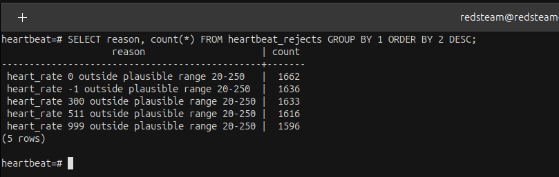
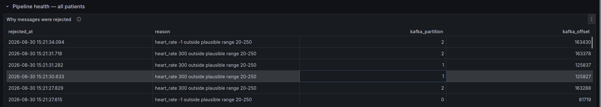

# Failure modes

What breaks it, what survives, and what is lost. Every result here came from running
the thing.

`scripts/demo_failure_modes.sh` reproduces and asserts the tests.


### Consumer killed mid-stream

A consumer is `SIGKILL`ed while the producer is still running, then restarted.

```
killed with SIGKILL after 677 of 2000 rows were written
recovery: consumed=1313 inserted=1288 duplicates=0 rejected=25
PASS  no records lost (2000)
PASS  no records duplicated (1965)
```

### Consumer-group rebalance

When a second consumer joins, Kafka redistributes the partitions automatically.

```
A: assigned [0,1,2] → revoked [0,1,2] → assigned [0,1]
B: assigned [2]
```

### Malformed messages

Invalid messages are rejected without stopping the pipeline.

```
not valid JSON: Expecting value: line 1 column 1 (char 0)
heart_rate must be an integer, got 'seventy'
event_id is not a UUID: 'not-a-uuid'
missing field(s): event_id, event_time, heart_rate
not valid JSON  (invalid UTF-8)
```

### Broker failure

`kafka2` is stopped while data is still flowing.

```
before      partition 2   leader 2   replicas [1,2,3]   isr [1,2,3]
one down    partition 2   leader 3   replicas [1,2,3]   isr [1,3]   UNDER-REPLICATED, missing [2]
recovered   partition 2   leader 3   replicas [1,2,3]   isr [1,2,3]

PASS  ingestion continued through the broker failure (7822 -> 10254 rows)
PASS  in-sync replicas degraded while it was down (4)
PASS  in-sync replicas recovered (0)
PASS  still no duplicates (19623)
```

Leadership moves to another broker and ingestion continues while the failed replica recovers.

## Sudden shutdowns

The committed Kafka offset is the recovery boundary. Data already committed to PostgreSQL is durable; anything after the offset is replayed.

| Failure | What is lost | What happens on resume |
|---|---|---|
| Consumer, `SIGTERM` | nothing — the batch in hand finishes and commits | resumes at the committed offset, replays nothing |
| Consumer, `SIGKILL` | nothing durable — the uncommitted batch is still on the topic | replays that batch, `ON CONFLICT` absorbs it |
| PostgreSQL | nothing durable — same uncommitted batch | leaves the group cleanly, exits 3; replays on restart |
| Every broker, consumer running | nothing — with no messages there is nothing to commit | self-heals: session times out, rejoins, carries on |
| Every broker, producer running | every buffered reading | reported as `unflushed`, exit 1. Those readings are gone |
| Producer, `SIGTERM` | nothing — `close()` flushes what is buffered | starts fresh; there is nothing to replay |
| Producer, `SIGKILL` | whatever sat in the local buffer, **with no record of it** | starts fresh; the gap is permanent |

The consumer is safe because the order is fixed:

**write rows → commit offsets**

If interrupted between those steps, Kafka replays the batch and the primary key absorbs duplicates.

## Evidence on rejections

Rejections carry the reason and the exact log position they came from — nothing is
silently dropped:



The dashboard's pipeline health band shows the same, live:


