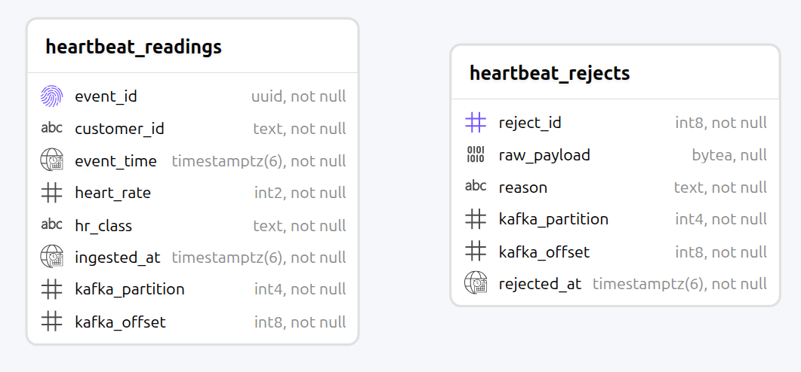

# Test plan

Three layers: unit tests for the pure logic, integration tests and the demo script.

```bash
.venv/bin/python -m pytest         # 61 unit tests
make test-all                      # + 11 integration tests
./scripts/demo_failure_modes.sh    # end-to-end proofs (resets the stack)
```

The integration tests truncate their tables; Note.

## Unit tests

| # | Case | Expected | Result |
|---|---|---|---|
| U1 | Event survives a JSON round trip | Parsed event equals the original | Pass |
| U2 | Two new events with the same inputs | Different `event_id` | Pass |
| U3 | Message key | Equals `customer_id` as bytes | Pass |
| U4 | Payload is not JSON | `SchemaError: not valid JSON` | Pass |
| U5 | Payload is a JSON array | `SchemaError: expected a JSON object` | Pass |
| U6 | Payload is not valid UTF-8 | `SchemaError`, no crash | Pass |
| U7 | Required fields missing | Error names every missing field | Pass |
| U8 | `heart_rate` is `true` | Rejected — `bool` subclasses `int` | Pass |
| U9 | `heart_rate` is a string, float or null | Rejected | Pass |
| U10 | `event_time` has no timezone offset | Rejected | Pass |
| U11 | `event_time` is unparseable | Rejected | Pass |
| U12 | `event_id` is not a UUID | Rejected | Pass |
| U13 | `event_id` or `customer_id` is empty | Rejected | Pass |
| U14 | Unknown `schema_version` with an extra field | Accepted, version carried | Pass |
| U15 | Band boundaries 20, 59, 60, 100, 101, 180, 181, 250 | brady, brady, normal, normal, tachy, tachy, critical, critical | Pass |
| U16 | Values -1, 0, 19, 251, 999 | `ImplausibleReading` | Pass |
| U17 | 190 bpm | `critical` — stored, not discarded | Pass |
| U18 | Class names | Match the database `CHECK` constraint exactly | Pass |
| U19 | Heart rate bands out of ascending order | `ConfigError` | Pass |
| U20 | Generator rates outside 0–1, or summing above 1 | `ConfigError` | Pass |
| U21 | Zero customers, zero rate, zero batch size or timeout | `ConfigError` | Pass |

**U14** is to help with schema evolution.

## Integration tests

The schema these run against.



Against a real PostgreSQL, because the deduplication guarantee is enforced by the
schema rather than by application code.

| # | Case | Expected | Result |
|---|---|---|---|
| I1 | Schema applied to an empty database | Both tables present and empty | Pass |
| I2 | A batch of readings written | Row count matches the batch | Pass |
| I3 | The same batch written again | 0 inserted, total unchanged | Pass |
| I4 | A batch overlapping a previous one | Only the new rows inserted | Pass |
| I5 | The same reject written twice | Second is suppressed by `(partition, offset)` | Pass |
| I6 | Reject payload is not valid UTF-8 | Stored — the column is `bytea` for this reason | Pass |
| I7 | Heart rate of 900 | `CheckViolation` from the database | Pass |
| I8 | Classification not in the constraint list | `CheckViolation` from the database | Pass |
| I9 | A batch where one row violates a constraint | Whole batch rolls back, nothing stored | Pass |
| I10 | Writing again after a failed batch | Succeeds — the connection is still usable | Pass |
| I11 | `ingested_at` | Stamped by the database, at or after `event_time` | Pass |

**I9** justifies the transaction.

## End-to-end tests

| # | Case | Method | Expected | Result |
|---|---|---|---|---|
| E1 | Topics are created | `heartbeat create-topics` | `heartbeat.raw` with 3 partitions, `heartbeat.dlq` with 1 | Pass |
| E2 | Creation is idempotent | Run it twice | Second run reports "already exists and matches config", no error | Pass |
| E3 | Schema on a fresh volume | `docker compose up -d` | 2 tables, 7 indexes, no manual step | Pass |
| E4 | Schema is idempotent | `heartbeat init-db` on an existing database | Applies cleanly, no error | Pass |
| E5 | Readings reach Kafka | `heartbeat produce --count 500` | `sent=500 delivered=500 failed=0` | Pass |
| E6 | Keying holds ordering | Consume 500 and group by key | No customer appears on more than one partition | Pass |
| E7 | Readings reach PostgreSQL | `heartbeat consume --drain` | 492 stored, 8 rejected, 0 duplicates | Pass |
| E8 | Abnormal readings are kept | Query by `hr_class` | 14 tachycardia/critical rows stored, not dropped | Pass |
| E9 | Replay does not duplicate | Re-consume the same topic as a new group | `inserted=0 duplicates=492`, row counts unchanged | Pass |
| E10 | Consumer killed mid-stream | `SIGKILL` with the producer still running, then restart | Stored + rejected equals produced; no duplicate `event_id` | Pass |
| E11 | Second consumer joins | Start a second member of the group | Partitions redistribute; both logs show the reassignment | Pass |
| E12 | Malformed messages | Inject 5 broken payloads | All 5 in `heartbeat_rejects` with distinct reasons; consumer keeps running | Pass |
| E13 | Poison forwarded for replay | Check `heartbeat.dlq` offsets | Rejected messages present on the topic | Pass |
| E14 | Consumer lag is observable | `kafka-consumer-groups.sh --describe` | Per-partition lag reported | Pass |
| E15 | Grafana is provisioned | `docker compose up -d` on a clean volume | Datasource connects, dashboard and alert rule present | Pass |
| E16 | Alert fires on a real condition | Ingest readings above the critical threshold | Rule goes `pending` then `firing` with value 1 | Pass |
| E16a | Chart surfaces a spike | Query the panel for a customer with a 250 bpm reading | `peak` series reaches 250; the old `avg` version drew 78 | Pass |
| E16b | Chart surfaces a dip | Same customer, `low` series | Reaches 21 bpm, crossing the bradycardia band | Pass |
| E17 | Topics are replicated | `heartbeat topic-info` | Every partition `replicas [1,2,3] isr [1,2,3]` | Pass |
| E18 | A topic that exists but does not match config | Recreate the DLQ at RF=1, run `create-topics` | Refused with the mismatch named, exit 1 | Pass |
| E19 | A broker dies mid-stream | `docker compose stop kafka2` while producing | Row count keeps climbing while the broker is down; exact figures in `proof4-*` | Pass |
| E20 | Leadership fails over | Compare `topic-info` before and during | Partition 2 leader moves from broker 2 to 3 | Pass |
| E21 | In-sync replicas shrink | `topic-info` while one broker is down | All 4 partitions under-replicated, missing [2] | Pass |
| E22 | The broker rejoins | `docker compose start kafka2` | ISR returns to [1,2,3] on every partition | Pass |
| E23 | No duplicates across a failover | Count after the whole episode | 19,623 rows, 19,623 distinct `event_id` | Pass |
| E24 | PostgreSQL dies mid-consume | `docker compose stop postgres` with the consumer running | Partitions revoked, stats logged, clean message, exit 3 — no traceback, no hang | Pass |
| E25 | Recovery after the database returns | Restart it, re-run `consume --drain` | Remaining 3,318 consumed, `duplicates=0`, lag 0, rows = distinct | Pass |
| E26 | Producer `SIGTERM` | Kill gracefully mid-run | `sent=1167 delivered=1167 failed=0 unflushed=0`, exit 0 | Pass |
| E27 | Producer `SIGKILL` | Kill outright mid-run | ~1,149 of ~1,200 reached the topic; the buffered remainder lost with no report | Pass |
| E28 | Every broker down, producer running | Stop all three, then produce | `delivered=0 unflushed=200`, logged as an error, exit 1 — never silently dropped | Pass |
| E29 | Every broker down, consumer running | Stop all three for 20s, restart | Consumer survives, session times out, partitions reassigned, catches up 7,247 rows | Pass |
| E30 | Consumer `SIGTERM` | Kill gracefully | Exit 0; restarting the same group consumes 0 — every batch was committed | Pass |
| E31 | Contract gains a field | Inject `schema_version=2` plus two unknown keys | Stored — unknown keys ignored, old consumer unaffected | Pass |
| E32 | Required field removed | Inject a payload without `heart_rate` | Rejected: `missing field(s): heart_rate` | Pass |
| E33 | Field type changed | `heart_rate` as `"72"` | Rejected: `heart_rate must be an integer` | Pass |
| E34 | Field renamed | `bpm` in place of `heart_rate` | Rejected: `missing field(s): heart_rate` | Pass |
| E35 | Field meaning changed | Structurally valid payload, different semantics | **Stored, undetected** — the known gap | Pass |
| E36 | Kafka data survives a restart | 300 messages, `docker compose down` then `up` | Topics present, 300 messages still there, ISR complete | Pass |